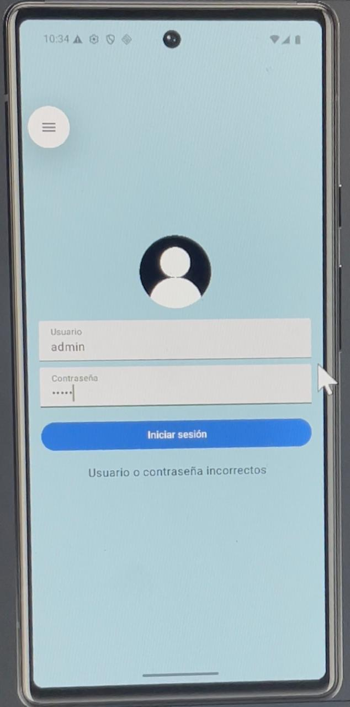

# AppTap 📱

Una aplicación Android desarrollada en Jetpack Compose que permite al usuario iniciar sesión y acceder a un menú de ejercicios. 
---

## 🧠 Funcionalidad

- Pantalla de **Inicio de Sesión** con validación básica (`admin` / `1234`)
- Navegación entre pantallas usando **Jetpack Navigation**
- Pantalla principal **"Menú de Ejercicios"** con botones estilizados
- Acceso a **10 ejercicios diferentes**
- Botón de **salida** para regresar al login
- Estilo moderno con colores personalizados y adaptados

---

## 🚀 Tecnologías utilizadas

- **Kotlin**
- **Jetpack Compose**
- **Material 3**
- **Navigation Compose**
- **Android Studio / VS Code (opcional)**

---

## 🎨 Diseño de la interfaz

La interfaz sigue una paleta profesional inspirada en Material Design:

| Elemento             | Color                  |
|----------------------|------------------------|
| Fondo                | `#F5F7FA`              |
| Botones de ejercicio  | `#1E88E5` (Azul)       |
| Texto de botones      | Blanco                 |
| Botón de salir        | `#EF5350` (Rojo suave) |
| Título principal      | `#2C3E50` (Azul petróleo) |
| Texto general        | `#1A1A1A` (Negro grisáceo) |

---

## 📱 Capturas de pantalla 



---

## 🛠 Cómo ejecutar el proyecto

1. Clona este repositorio:
   ```bash
   git clone https://github.com/tu-usuario/AppTap.git
---

## 🛠 Cómo ejecutar el proyecto

- Ábrelo en Android Studio o cualquier IDE con soporte para Kotlin y Jetpack Compose.
- Ejecuta el proyecto en un emulador o dispositivo físico.

---

## 🔑 Credenciales de prueba

- Usuario: `admin`
- Contraseña: `1234`

---

## 📂 Estructura del proyecto

com.example.apptap/
│
├── MenuScreen.kt # Pantalla principal con botones de ejercicios
├── LoginScreen.kt # Pantalla de inicio de sesión
├── MainActivity.kt # Configura la navegación
└── ...otros archivos
---

## 💻 Ejemplo de código

Aquí un ejemplo simplificado del botón de inicio de sesión con validación:

```kotlin
Button(
    onClick = {
        if (username == "admin" && password == "1234") {
            navController.navigate("menu")
        } else {
            message = "Usuario o contraseña incorrectos"
        }
    },
    modifier = Modifier.fillMaxWidth(),
    colors = ButtonDefaults.buttonColors(
        containerColor = Color(0xFF1E88E5), // Azul profesional
        contentColor = Color.White
    )
) {
    Text("Iniciar sesión")
}
```

##🤝 Contribuciones

-Juarez Ramire Daniel Alexis
-Bautista Centeno Francisco Elias
